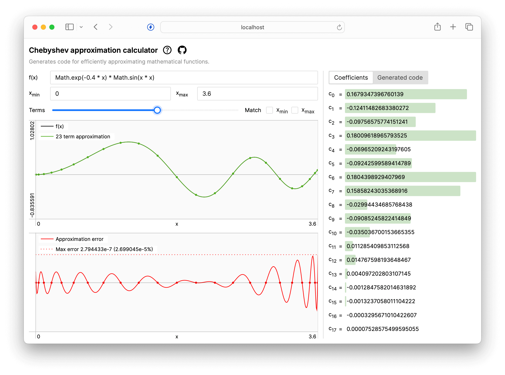

# Chebyshev approximation calculator

This is a web app that generates code for efficiently approximating mathematical functions of one variable (you can [try it out here](https://stuffmatic.com/chebyshev)). This is useful when performance matters more than perfect accuracy, for example in embedded systems. The app can currently generate C, Go, Python and Rust code.

Functions are approximated using so called [Chebyshev expansions](https://en.wikipedia.org/wiki/Chebyshev_polynomials), which are numerically well behaved and can be [evaluated very efficiently](https://en.wikipedia.org/wiki/Clenshaw_algorithm). From a programmer's point of view, a Chebyshev expansion is just an array of numbers (coefficients) that is passed to a simple function that iterates over them to evaluate the approximation. This code is generated for you. For smooth enough target functions, the coefficients quickly approach zero and only a few are needed to get a close approximation.

If you need to compute and evaluate Chebyshev expansions in Rust, check out the [microcheby ](https://github.com/stuffmatic/microcheby) crate.

## User guide

1. Enter the function you want to approximate in the _f(x)_ field as a valid Javascript expression of the variable `x`, for example `Math.cos(x)`. Make sure the expression evaluates to a finite number on the specified interval.
2. Specify the interval to approximate using the _x min_ and _x max_ fields.
3. Drag the _terms_ slider until the error graph shows an acceptable maximum error. This controls the number of coefficients, i.e the number of terms in the Chebyshev expansion.
4. Go to the _Generate code_ tab, select a language and copy the code to the clipboard. 

### Pro tips

* If you're not able to approximate your function with a reasonable number of coefficients, consider splitting the x interval into smaller parts and compute separate approximations for each of them.
* You can enter any valid Javascript expression of `x` into the _f(x)_ field, but if your function is too complex to be expressed as a one-liner, you may want to consider dropping the self contained [`ChebyshevExpansion`](src/util/chebyshev-expansion.ts) class into your own Typescipt code.

## Building and running

The app is built with [React](https://react.dev/), [Typscript](https://www.typescriptlang.org/), [Vite](https://vitejs.dev/) and [Yarn](https://yarnpkg.com/). Run `yarn` to install dependencies, then `yarn dev` to start the dev server which serves the app on the URL displayed in the terminal. See [`package.json`](package.json) for other available commands.